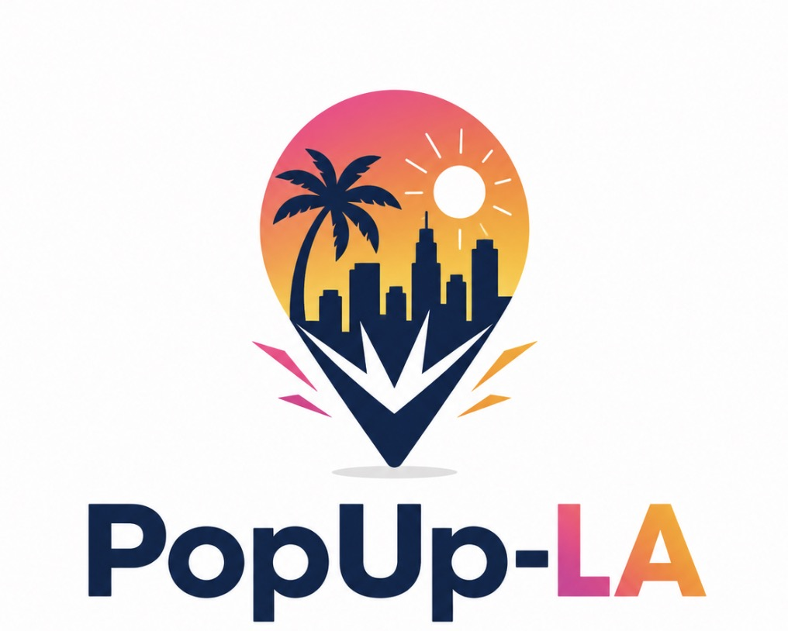

# DESIGN.md — PopUp-LA

This document defines the visual look and feel that drives the PopUp-LA product.

## Logo

The PopUp-LA logo is a map-pin mark whose rounded top frames a Los Angeles sunset
scene — a silhouetted palm tree, the downtown skyline, and a radiant sun — over a
warm pink-to-gold gradient. The pin tapers to a sharp point with a small "pop"
burst of pink and gold accent shards, evoking a temporary event bursting onto the
map. Below the mark sits the **PopUp-LA** wordmark: "PopUp-" in deep navy and "LA"
in the same pink-to-orange sunset gradient.



## Concept

A location pin + an LA sunset + a burst of energy. The mark says, at a glance:
*something is happening, right here, right now, in Los Angeles.* The design language
should feel bright, welcoming, and trustworthy — celebratory without being loud,
and always safety- and privacy-first per [REQUIREMENTS.md](REQUIREMENTS.md).

## Color Palette

Derived from the logo gradient and wordmark.

| Token | Hex | Use |
|---|---|---|
| Navy (primary) | `#1B2A4A` | Wordmark, headings, primary text, pin outline |
| Sunset Pink | `#F63B7C` | Gradient start, accents, highlights |
| Sunset Coral | `#F9633F` | Gradient mid |
| Sunset Gold | `#FBA83C` | Gradient end, warm accents |
| Off-White | `#FDFDFB` | Background / canvas |
| Neutral Gray | `#8A8F9A` | Secondary text, borders, shadows |

**Signature gradient:** linear, pink → coral → gold (`#F63B7C → #F9633F → #FBA83C`),
used for the sun scene, the "LA" wordmark, and primary calls to action.

```css
--sunset-gradient: linear-gradient(135deg, #F63B7C 0%, #F9633F 50%, #FBA83C 100%);
```

## Typography

- **Wordmark / display:** a bold, rounded geometric sans (friendly, high-weight,
  generous curves — matching the logo lettering).
- **UI / body:** a clean, highly legible sans-serif (system UI stack or a rounded
  humanist sans) for maximum readability on mobile.
- Prioritize contrast and legibility to meet the WCAG 2.2 AA target (A11Y-001).

## Look and Feel Principles

1. **Mobile-first.** Design for the phone screen first; touch targets, thumb reach,
   and fast scanning of event listings drive layout.
2. **Sunset warmth, navy trust.** Warm gradients signal energy and discovery; navy
   grounds the brand in reliability and safety.
3. **The pin is the hero.** Location and "what's happening near me" are central —
   but exact private locations are never exposed (see LOC / HOME requirements).
4. **Celebratory, not chaotic.** Use the burst/pop motif sparingly as an accent for
   new or featured events; keep listings calm and readable.
5. **Accessible by default.** No color-only meaning; strong contrast; alt text on
   all event imagery; keyboard-navigable core flows.
6. **Honest UI.** Never present approval, safety, or refunds as guaranteed. Labeling
   (sponsored, under review, canceled) is always clear and truthful.
